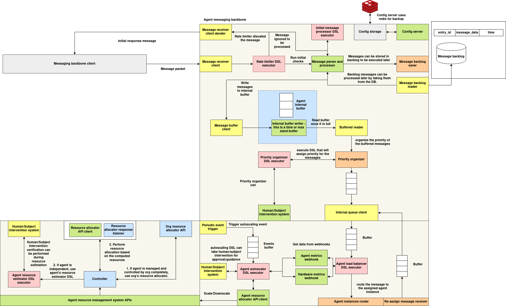

# Agent communication system

## Architecture



The Agent Communication System is a modular, policy-driven messaging architecture designed to manage scalable, asynchronous, and intelligent interactions between distributed agents. The architecture is organized into three primary subsystems:

1. **Agent Messaging Backbone**
2. **Agent Resource Management APIs**
3. **Agent Instance Routing and Load Balancing**


### 1. Agent Messaging Backbone

At the core of the architecture is the **Agent Messaging Backbone**, responsible for receiving, validating, buffering, and dispatching messages.

* **MessageReceiverClient** handles inbound packets from external messaging clients (e.g., NATS or WebSocket).
* A **Rate Limiter DSL Executor** enforces dynamic, per-sender constraints and may discard messages if thresholds are violated.
* The validated messages proceed to a **Message Parser and Processor**, which can forward them directly or store them using the **Message Backlog Saver** for deferred execution.
* Messages are temporarily stored in an **Internal Buffer**, coordinated by the **Message Buffer Client**. When the buffer fills (by time or size), messages are flushed for prioritization.
* The **Priority Organizer DSL Executor** assigns message importance, which informs routing via the **Internal Queue Client**.

---

### 2. Agent Resource Management APIs

This subsystem governs resource allocation and scaling using runtime metrics and subject-specific policies.

* The **Agent Resource Estimator DSL Executor** evaluates capacity requirements.
* If applicable, the system invokes the **Org Resource Allocator API** or the agent’s own **Resource Allocator API**.
* The **Controller** coordinates this process, while the **Resource Allocator Response Listener** captures allocation decisions.
* Human or subject-based approval can optionally be inserted via the **Intervention System**, particularly during critical evaluations.

---

### 3. Agent Instance Router and Load Balancer

Once prioritized, messages are routed to agent instances using real-time system metrics and runtime policies.

* A **Buffered Reader** feeds the **Priority Organizer**, which determines optimal ordering.
* The **Agent Load Balancer DSL Executor** selects an instance by combining internal buffer state, hardware metrics, and Prometheus-style monitoring data.
* The **Internal Queue Client** dispatches the message to the selected agent for processing.

Autoscaling is triggered by periodic event buffers and handled by the **Agent Autoscaler DSL Executor**, which can consult the **Human/Subject Intervention System** before submitting scale decisions to the **Agent Resource Allocator API Client**.

---

## Message Server Sub system

### Introduction

The **Message Server** is a unified communication gateway for agent-based systems that enables real-time message reception via both **NATS** and **WebSocket** protocols. It acts as the entry point for incoming messages, enforcing **DSL-driven rate limiting policies** and forwarding validated payloads to the backend processing pipeline, typically handled by the `MessageHandler`.

This design decouples **message transport**, **rate control**, and **execution semantics**, enabling scalable and policy-aware message ingestion across distributed environments.

---

### Architecture Overview

**MessageReceiverClient** is the core server abstraction that:

* Listens to NATS subjects or WebSocket connections
* Applies per-sender rate limiting using a DSL-configured `RateLimiter`
* Routes the message to a pluggable async handler (e.g., `MessageHandler`)

Each incoming message goes through:

1. **Protocol decoding**
2. **Rate limit enforcement**
3. **Custom handler invocation**
4. **Response dispatch** (reply or socket send)

---

### MessageReceiverClient

#### Constructor

```python
MessageReceiverClient(handler_function, rate_limiter=None)
```

| Parameter          | Type                     | Description                                                       |
| ------------------ | ------------------------ | ----------------------------------------------------------------- |
| `handler_function` | `Callable` (async)       | Async function that processes validated messages.                 |
| `rate_limiter`     | `RateLimiter` (optional) | Optional DSL-based rate limiter to control sender request volume. |

---

### Supported Protocols

#### 1. NATS

* Connects to a NATS server at a configurable URL (`nats://127.0.0.1:4222` by default).
* Subscribes to a subject equal to the value of the `SUBJECT_ID` environment variable.
* Responds using `msg.reply` to support request-response pattern.

##### Method

```python
async def start_nats_server(nats_url="nats://127.0.0.1:4222")
```

---

#### 2. WebSocket

* Hosts a WebSocket server (default: `127.0.0.1:8765`).
* Accepts full-duplex JSON messages from connected clients.
* Replies to the sender over the same socket.

##### Method

```python
async def start_websocket_server(host="127.0.0.1", port=8765)
```

---

### Execution Entrypoints

* `run_nats_server(...)`
  Launches the NATS server using `asyncio.run(...)`

* `run_websocket_server(...)`
  Launches the WebSocket server similarly

* `start()`
  Starts both NATS and WebSocket servers concurrently on background threads

---

### Rate Limiting (DSL-based)

The message server integrates a **DSL-driven RateLimiter** to enforce per-sender constraints. This allows dynamic, context-aware rules such as:

* Different request limits per role or group
* Time-based throttle windows
* Complex multi-condition limits

**Rate limiting occurs before** messages are forwarded to the handler.

Example logic:

```python
if rate_limiter and not rate_limiter.is_allowed(sender_subject_id):
    return {"success": False, "message": "Rate limit exceeded"}
```

Each sender (identified by `sender_subject_id`) is tracked separately. Policy violations result in rejected responses.

---

### Common Handler

A standard async handler template is provided:

```python
async def common_handler_function(message, rate_limiter):
    sender_subject_id = message.get("sender_subject_id")

    if rate_limiter and not rate_limiter.is_allowed(sender_subject_id):
        return {"success": False, "message": "Rate limit exceeded"}

    # Further processing can be delegated here
    return {"success": True, "message": "Message received"}
```

This function can be replaced with a production-grade processor like `MessageHandler.parse_and_process_message(...)`.

---

### Environment Variables

| Variable     | Description                        |
| ------------ | ---------------------------------- |
| `SUBJECT_ID` | NATS subject name to subscribe to. |


---

## Sending Messages to the Message Server

The Message Server supports two communication protocols:

* **NATS**: Suitable for lightweight, low-latency, and brokered message delivery.
* **WebSocket**: Ideal for persistent, bi-directional communication between agents or browser-based clients.

This section provides guidance on how external agents or services can **construct and send messages** to the server in either mode.

---

### Message Format

All messages sent to the server must be JSON-encoded with the following required structure:

```json
{
  "event_type": "task_start",
  "sender_subject_id": "agent_42",
  "event_data": {
    "message_id": 12345,
    "timestamp": "2025-06-06T12:00:00Z",
    "payload": { "task_id": "t-001", "priority": "high" }
  }
}
```

| Field               | Type   | Description                                                 |
| ------------------- | ------ | ----------------------------------------------------------- |
| `event_type`        | `str`  | The semantic type of event (e.g., `task_start`, `result`).  |
| `sender_subject_id` | `str`  | Unique identifier of the agent sending the message.         |
| `event_data`        | `dict` | Payload containing `message_id`, `timestamp`, and metadata. |

---

## Python Example – Sending Messages

The following Python example demonstrates how to send a message to the Message Server via both **NATS** and **WebSocket**.

### Install Dependencies

```bash
pip install nats-py websockets
```

---

### 1. Send via NATS

```python
import asyncio
import json
from nats.aio.client import Client as NATS

async def send_nats_message():
    nc = NATS()

    await nc.connect("nats://127.0.0.1:4222")

    message = {
        "event_type": "task_start",
        "sender_subject_id": "agent_001",
        "event_data": {
            "message_id": 1001,
            "timestamp": "2025-06-06T12:00:00Z",
            "payload": { "task_id": "t42" }
        }
    }

    # Replace with the actual SUBJECT_ID value expected by the server
    subject = "agent_001"
    response = await nc.request(subject, json.dumps(message).encode(), timeout=2)

    print("Response:", json.loads(response.data.decode()))
    await nc.close()

asyncio.run(send_nats_message())
```

---

### 2. Send via WebSocket

```python
import asyncio
import websockets
import json

async def send_ws_message():
    uri = "ws://127.0.0.1:8765"
    async with websockets.connect(uri) as websocket:
        message = {
            "event_type": "task_start",
            "sender_subject_id": "agent_002",
            "event_data": {
                "message_id": 1002,
                "timestamp": "2025-06-06T12:05:00Z",
                "payload": { "task_id": "t99" }
            }
        }
        await websocket.send(json.dumps(message))

        response = await websocket.recv()
        print("Response:", json.loads(response))

asyncio.run(send_ws_message())
```

---

### Response Format

Upon success, the server responds with:

```json
{
  "success": true,
  "message": "Message received"
}
```

If rate limiting is exceeded or the message is malformed:

```json
{
  "success": false,
  "message": "Rate limit exceeded"
}
```

---

## Message Handling sub-system

### Introduction

The **Message Handling sub-system** module provides a robust and extensible framework for persistently handling messages that require deferred processing. This component is designed to support asynchronous, policy-driven systems where incoming events must either be enqueued for immediate execution or stored reliably for later evaluation and execution. The system provides storage backends with interchangeable implementations based on operational needs—namely **SQLite** for local persistence and **Redis** for distributed, in-memory performance.

This module integrates tightly with a **Domain-Specific Language (DSL)-based decision engine**, allowing dynamic runtime evaluation of message handling policies. It is suitable for systems requiring recoverable queuing, flexible message dispatching, and conditional execution paths.

---

### Schema

#### SQLite Backlog Storage

In SQLite mode, messages are stored in a local database file under a schema defined as follows:

```sql
CREATE TABLE IF NOT EXISTS message_backlog (
    entry_id INTEGER PRIMARY KEY,
    message_data TEXT NOT NULL,
    timestamp TEXT NOT NULL
);
```

This schema includes:

| Field          | Type    | Description                                                             |
| -------------- | ------- | ----------------------------------------------------------------------- |
| `entry_id`     | INTEGER | Unique identifier for the message (same as `message_id`).               |
| `message_data` | TEXT    | JSON-serialized message payload.                                        |
| `timestamp`    | TEXT    | Timestamp associated with the message, used for chronological ordering. |

SQLite is suitable for environments that require lightweight, file-based persistence without the overhead of external service dependencies.

#### Redis Backlog Storage

In Redis mode, each message is represented as a hash map and stored under the key namespace `message_backlog:<message_id>`. The structure of each Redis key is as follows:

* Key: `message_backlog:<message_id>`
* Value (Hash Fields):

| Field          | Type   | Description                                                         |
| -------------- | ------ | ------------------------------------------------------------------- |
| `message_data` | String | JSON-serialized message content.                                    |
| `timestamp`    | String | Associated timestamp for chronological or conditional reprocessing. |

Redis is recommended in distributed systems requiring low-latency access and resilience through in-memory operations.

---

### Message Handling Logic

The **MessageHandler** class is the primary component responsible for processing incoming messages. It performs message validation, policy evaluation via a DSL executor, and conditional queuing or backlogging based on dynamic rules.

#### Initialization Parameters

| Parameter        | Type    | Description                                                              |
| ---------------- | ------- | ------------------------------------------------------------------------ |
| `op_queue`       | `Queue` | A thread-safe queue for downstream operational processing.               |
| `backlog_dsl_id` | `str`   | Optional identifier to initialize a DSL-based backlog decision executor. |
| `backlog_db`     | `str`   | Storage backend selection (`"sqlite"` or `"redis"`).                     |
| `redis_config`   | `dict`  | Optional Redis connection parameters (`host`, `port`, `db`).             |
| `sqlite_db_path` | `str`   | Optional SQLite database file path.                                      |

---

### Event Validation and Filtering

Before any execution logic is applied, messages are validated for structural integrity. The following fields are required:

* `event_type` (`str`): Identifier for the type of the event.
* `sender_subject_id` (`str`): Originator of the message.
* `event_data` (`dict`): The payload of the message, containing operational details.

In addition, an environment variable `SUBJECT_ALLOWED_EVENT_TYPES` is used to apply a filter on the types of events that are permissible:

* Format: JSON string — e.g., `'{"allowed_types": ["event_a", "event_b"]}'`
* If `"*"` is included in the list, all event types are accepted.

Messages not conforming to these constraints are rejected and logged accordingly.

---

### DSL-Based Backlog Decision Flow

The system supports integration with a DSL runtime executor which is used to determine the appropriate handling strategy for each incoming message. The handler invokes the configured DSL executor (if enabled) using the parsed message as input and expects a structured output determining the desired action.

#### Supported Actions

The decision logic is expected to return one of the following actionable results:

| Action                        | Description                                                                                             |
| ----------------------------- | ------------------------------------------------------------------------------------------------------- |
| `"backlog"`                   | The message is persisted in the configured backlog storage.                                             |
| `"pass"`                      | The message is immediately enqueued for processing.                                                     |
| `["load_backlog", "backlog"]` | Previously persisted backlog messages are loaded into the queue. The current message is also persisted. |
| `["load_backlog", "pass"]`    | Backlog is flushed into the queue. The current message is also enqueued.                                |

Any other unexpected return structure results in a validation error.

---

### Execution Path

The `parse_and_process_message(...)` method encapsulates the full lifecycle of a message, executing the following sequence:

1. **Parse and Validate**:

   * Deserialize the message.
   * Verify required fields and types.
   * Filter based on allowed `event_type`s.

2. **Evaluate Policy**:

   * Execute the DSL using the parsed message.
   * Extract and interpret the action result.

3. **Route Accordingly**:

   * **Backlog**: Store message.
   * **Pass**: Push message to processing queue.
   * **Load Backlog & Backlog**:

     * Persist current message.
     * Load all previously stored messages to queue.
     * Purge backlog.
   * **Load Backlog & Pass**:

     * Load backlog to queue.
     * Purge backlog.
     * Enqueue current message.

All operations are logged for observability, and exceptions during processing are captured and surfaced.

---

### Reliability Considerations

* **Durability**: SQLite guarantees data persistence across process restarts; Redis durability depends on persistence configuration (AOF/RDB).
* **Atomicity**: SQLite commits are performed per operation; Redis operations are atomic at the key level.
* **Recovery**: In case of system restart or DSL-triggered recovery, messages in the backlog are reintroduced to the processing pipeline as per policy.

---

Here is the official, structured documentation for the **Configuration Management Subsystem**, tailored for use in dynamic agent communication systems:

---

## Configuration Management Subsystem

### Introduction

The Configuration Management Subsystem provides a centralized, extensible, and runtime-configurable **key-value configuration interface** designed to serve distributed agent communication components. It enables external components to **retrieve** and **update** configuration parameters dynamically through a RESTful API or directly via code. This system supports both **in-memory** and **Redis-backed** storage, and includes a built-in watcher mechanism for **reactively responding to configuration changes** without restarting the system.

This is particularly valuable in environments where agent behavior, communication policies, or network thresholds need to adapt dynamically based on system state or external coordination.

---

## Configuration Server

### Class: `ConfigServer`

The `ConfigServer` class is responsible for the core logic of configuration persistence and retrieval.

#### Initialization Parameters

| Parameter            | Type   | Default                    | Description                                                             |
| -------------------- | ------ | -------------------------- | ----------------------------------------------------------------------- |
| `use_redis`          | `bool` | `False`                    | Enables Redis as the backend storage if `True`.                         |
| `redis_url`          | `str`  | `"redis://localhost:6379"` | Redis connection string used if Redis is enabled.                       |
| `default_config_env` | `str`  | `"SUBJECT_DEFAULT_CONFIG"` | Environment variable containing default key-value pairs in JSON format. |

---

### Methods

#### `set_config(key: str, value: Any) -> bool`

Sets the value for a given key. If Redis is enabled, stores in Redis. Otherwise, updates the in-memory dictionary.

#### `get_config(key: str) -> Any`

Retrieves the configuration value associated with the given key. If Redis is used and the key exists, the value is deserialized from Redis. Otherwise, fetches from in-memory storage.

#### `load_default_configs()`

Reads the default config JSON string from the environment variable `SUBJECT_DEFAULT_CONFIG` and initializes internal storage with these defaults.

---

### Environment Variable: `SUBJECT_DEFAULT_CONFIG`

This environment variable may contain a JSON object representing default configurations to preload at server startup.

Example:

```bash
export SUBJECT_DEFAULT_CONFIG='{
  "message_timeout": 30,
  "retry_limit": 5,
  "log_level": "INFO"
}'
```

---

### REST API

The configuration server exposes a REST interface using Flask.

#### Endpoint: `GET /config`

Retrieves the value associated with a given key.

* **Query Parameter**: `key` (required)
* **Response**:

  * `200 OK` with `{ success, key, value }` if found
  * `404 Not Found` if the key does not exist
  * `400 Bad Request` if key is missing

**Example cURL**:

```bash
curl "http://localhost:5000/config?key=retry_limit"
```

---

#### Endpoint: `POST /config`

Sets or updates the value for a given configuration key.

* **Request Body (JSON)**:

```json
{
  "key": "log_level",
  "value": "DEBUG"
}
```

* **Response**:

  * `200 OK` with `{ success: true }` on success
  * `400 Bad Request` if key/value is missing
  * `500 Internal Server Error` if persistence fails

**Example cURL**:

```bash
curl -X POST http://localhost:5000/config \
  -H "Content-Type: application/json" \
  -d '{"key": "log_level", "value": "DEBUG"}'
```

---

### Configuration Watcher

The `ConfigWatcher` provides a polling mechanism for components that require **reactive updates** when specific configuration keys are modified.

This enables communication components to **adapt their behavior** in real-time (e.g., updating timeout intervals or enabling/disabling certain modes) based on configuration changes.

---

#### Key Features

* Periodically polls keys from `ConfigServer`
* Maintains last known values for registered keys
* Invokes a callback whenever a change is detected

---


#### Polling Behavior

Internally, the watcher:

* Loops over all registered keys
* Calls `get_config(key)`
* Compares the value against the previously cached value
* Triggers the callback if a change is observed

Polling interval is defined at initialization (`poll_interval`, default: 5 seconds).

---

## Metrics Subsystem

### Introduction

The **Metrics Subsystem** is a centralized runtime monitoring and telemetry layer designed to support intelligent decision-making for **auto-scaling**, **load-balancing**, and **message routing** across distributed agent instances. It aggregates and exposes fine-grained operational data collected from the following systems:

* **Prometheus** – real-time performance and utilization metrics
* **Redis** – live queue depth tracking from each agent instance
* **Kubernetes** – instance-level discovery and resource metadata
* **Quota Registry APIs** – policy-defined subject resource entitlements

This subsystem is a critical component in adaptive agent-based environments, enabling coordinated resource allocation, congestion avoidance, and system-wide optimization.

---

### Architecture

The subsystem is composed of the following components:

#### 1. `MetricsInstance`

The orchestrator class responsible for end-to-end metrics aggregation. It invokes the underlying modules in the following sequence:

1. Discover agent pods using the Kubernetes API
2. Retrieve the resource quotas for the subject
3. Fetch live Prometheus metrics per instance
4. Measure Redis queue lengths across discovered instances

The aggregated result is returned as a structured dictionary suitable for autoscalers, message routers, or external monitoring systems.

---

### Component Modules

#### `K8sInstancesDiscovery`

Responsible for discovering active Kubernetes pods that belong to a specific subject. It performs:

* Label-based filtering (`subject_id`)
* Extraction of:

  * `instance_id` from pod metadata
  * Pod IP address
  * Redis queue port from container definitions

**Output Format**:

```json
{
  "instance-001": {
    "ip": "10.0.0.1",
    "port": 6379
  }
}
```

---

#### `ResourceQuotaAPI`

Queries a central quota registry via a RESTful API to obtain the resource allocation limits for a given subject.

* **Endpoint**: `POST /resource-quotas/query`
* **Request Payload**:

  ```json
  {
    "subject_id": "agent_xyz"
  }
  ```
* **Response**: Quota specifications (e.g., max replicas, CPU limits, etc.)

---

#### `PrometheusMetricsAPI`

Connects to a Prometheus server and executes label-based metric queries.

* **Query Format**:

  ```
  metrics_record{subject_id="<subject_id>", instance_id="<instance_id>"}
  ```
* **API Endpoint**: `GET /api/v1/query`
* **Response**: Prometheus result vector for each matching time series

Supports fetching metrics per instance or in batch across multiple replicas.

---

#### `RedisQueueLength`

Establishes Redis connections to each discovered agent instance and computes the length of the `"inputs"` queue.

* Used to assess queue congestion or message backlog per instance
* Helps determine routing pressure and load-balance preferences

**Output Format**:

```json
{
  "instance-001": 4,
  "instance-002": 10
}
```

---

### Metrics Pull Interface

#### Method: `MetricsInstance.pull(subject_id: str) -> dict`

Executes the complete data aggregation process for the provided subject ID.

**Example Output**:

```json
{
  "quotas": [...],
  "instances": {
    "instance-001": { "ip": "10.0.0.1", "port": 6379 }
  },
  "metrics": {
    "instance-001": [...]
  },
  "queue_lengths": {
    "instance-001": 3
  }
}
```

Returned metrics are intended to be consumed by:

* Autoscaling controllers
* Load-balancing logic
* Policy enforcement engines

---

### Dynamic Configuration Parameters

The behavior of the Metrics Subsystem can be tuned at runtime using the **Config Server**. The following keys are available for configuration:

| Config Key                   | Description                                                               |
| ---------------------------- | ------------------------------------------------------------------------- |
| `METRICS_POLL_INTERVAL`      | Polling frequency for refreshing metrics (seconds). Default: `30`.        |
| `PROMETHEUS_QUERY_TEMPLATE`  | Custom PromQL template for metrics queries.                               |
| `MAX_QUEUE_LENGTH_THRESHOLD` | Threshold to identify overloaded agents based on Redis queue depth.       |
| `QUOTA_REFRESH_INTERVAL`     | Time interval (in seconds) to re-fetch resource quotas from the registry. |
| `QUEUE_LENGTH_WEIGHT`        | Weight factor for queue size in routing/load-balancing calculations.      |
| `CPU_UTILIZATION_WEIGHT`     | Weight factor for CPU usage in system scoring logic.                      |
| `AUTOSCALER_ENABLED`         | Enables or disables automated scaling policies at runtime.                |

These values can be updated dynamically via HTTP POST requests to the configuration server:

**Example**:

```bash
curl -X POST http://localhost:5000/config \
  -H "Content-Type: application/json" \
  -d '{"key": "MAX_QUEUE_LENGTH_THRESHOLD", "value": 15}'
```

---

### Use Cases

* **Auto-scaling triggers**: Scale agent replicas based on CPU usage or Redis queue size.
* **Load-aware message routing**: Distribute messages to less congested instances.
* **Policy enforcement**: Validate that subject behavior stays within quota-defined limits.
* **Observability & monitoring**: Integrate with Prometheus/Grafana dashboards for centralized monitoring.

---


## Agent Autoscaler and Load Balancer

### Introduction

In a distributed agent-based system, it's critical to maintain balance between available resources and workload. The **Autoscaler and Load Balancer** subsystem ensures this balance by:

* **Monitoring system health and load**
* **Automatically scaling agent instances up or down**
* **Routing incoming tasks to the best-suited agent instance**

This subsystem operates in the background and uses pre-defined decision logic to make smart, real-time choices — ensuring that agent performance remains efficient even under fluctuating load.

---

### How It Works

The subsystem runs two background threads and an optional message router:

Absolutely — here's the revised version of your documentation with **`MetricsProducer`** and **`MetricsConsumer`** replaced and clearly described under a consolidated **Autoscaler** section. The tone remains official and explanatory, while still clearly mapping to the underlying implementation.

---

## Agent Autoscaler and Load Balancer

### Introduction

In a distributed agent-based system, it's critical to maintain balance between available resources and workload. The **Autoscaler and Load Balancer** subsystem ensures this balance by:

* **Monitoring system health and load**
* **Automatically scaling agent instances up or down**
* **Routing incoming tasks to the best-suited agent instance**

This subsystem operates in the background and uses pre-defined decision logic to make smart, real-time choices — ensuring that agent performance remains efficient even under fluctuating load.

---

### How It Works

The subsystem includes two core capabilities:

1. **Autoscaling** — determines whether to increase or decrease the number of agent instances based on current system metrics.
2. **Load Balancing** — selects the best agent instance to handle an incoming task.

---

### Autoscaler

The autoscaler continuously monitors metrics and decides when scaling actions should be performed. It operates using two cooperative background threads:

#### **Metrics Collection and Evaluation**

The autoscaler gathers metrics at regular intervals and processes them using a DSL-defined policy. It does this in two stages:

1. **Collecting Metrics**

   * Periodically fetches information such as:

     * Number of active agent instances
     * Their current load (CPU usage, queue length, etc.)
   * Uses a dedicated component that integrates with Prometheus, Redis, and the Kubernetes API to collect this data

2. **Making Scaling Decisions**

   * The collected data is passed into a DSL workflow that analyzes the system’s state
   * Based on the logic defined in the workflow, the autoscaler determines:

     * Whether to scale up (add more replicas)
     * Whether to scale down (reduce resource usage)
   * If a decision is made, it prepares a structured scaling request
   * This request is then validated and sent to the resource manager, which carries out the actual scaling action

All of this happens automatically and continuously, without manual intervention.

---

### Load Balancer

This is an optional component used by message routers. When a new task arrives, the LoadBalancer:

* Retrieves the latest metrics on running agent instances
* Uses a DSL workflow to evaluate conditions like load, queue length, or instance availability
* Selects the most suitable instance to handle the task
* Returns the selected `instance_id` to the router

This ensures that messages are sent to agents that are least busy or most capable of processing the task efficiently.

---

### Runtime Configuration

The behavior of this subsystem can be adjusted without changing the code — using runtime configuration parameters.

Here are some examples of parameters that can be set or updated dynamically (e.g., using a config server):

| Key                         | Description                                        |
| --------------------------- | -------------------------------------------------- |
| `ORG_AUTOSCALER_INTERVAL`   | How often metrics should be collected (in seconds) |
| `SCALING_THRESHOLD_CPU`     | Max CPU usage before scaling up is considered      |
| `SCALING_THRESHOLD_QUEUE`   | Max queue length before scaling is triggered       |
| `MAX_REPLICA_LIMIT`         | Maximum number of agent instances allowed          |
| `MIN_REPLICA_LIMIT`         | Minimum number of agent instances to keep running  |
| `LOAD_BALANCER_WORKFLOW_ID` | DSL ID for load balancing rules                    |
| `WORKFLOW_ID`               | DSL ID for scaling rules                           |

These values can be updated at runtime, allowing system administrators to fine-tune scaling and routing behavior without restarting services.

---

Certainly. Below is the **official documentation** for the **Chat Proxy Server**, written from a **usability-focused point of view** with a clear **introduction**, **architecture explanation**, and a **guide on how to send and receive messages through the proxy**.

---

## Chat Proxy Server

### Introduction

The **Chat Proxy Server** provides a unified WebSocket interface to interact with distributed chat agents deployed as Kubernetes pods. It simplifies the communication flow between users and chat agents by:

* Acting as a **reverse proxy** between clients and dynamically discovered agent instances
* Supporting **WebSocket-based, session-aware communication**
* Automatically routing messages to available chat server pods using basic **load balancing**
* Managing **persistent bi-directional connections** for streaming conversations

This allows client applications to connect to a single endpoint while the proxy transparently forwards messages to the correct agent instance based on session context.

---

### Message Format

All messages exchanged with the proxy must be valid JSON and include a `session_id`.

**Example:**

```json
{
  "session_id": "abc-123-session",
  "message": "Hello, how can I use the product?"
}
```

---

### Connecting as a WebSocket Client

You can connect to the proxy server using any WebSocket client (e.g., browser, Python, or frontend JS). Below is a Python example:

#### Python WebSocket Client Example

```python
import asyncio
import websockets
import json

async def chat():
    uri = "ws://localhost:9000"
    async with websockets.connect(uri) as websocket:
        session_id = "user-session-001"
        message = {
            "session_id": session_id,
            "message": "Hi, I need help with my order."
        }

        await websocket.send(json.dumps(message))
        response = await websocket.recv()
        print("Response from chat agent:", response)

asyncio.run(chat())
```

