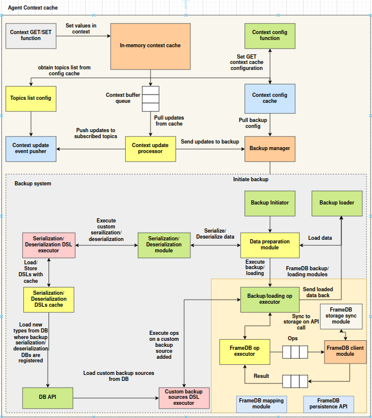

# Agent context cache

## Introduction

The **Agent Context Cache** is a modular, pluggable, and event-driven in-memory and distributed key-value store designed for intelligent agents and dynamic runtime systems. It supports:

* Fast **in-memory** storage for low-latency access
* Optional **Redis** integration for persistent caching
* A **pluggable architecture** where users can define their own primary and secondary backends
* **Dual write mode**, enabling simultaneous storage to both local and remote systems
* A **buffered update system** that processes events asynchronously
* **NATS-based broadcasting** of context updates to subscribed systems
* Lightweight **namespace isolation** to scope key-value pairs
* Configurable **backup control** and **topic management**

It is ideal for use in AI agents, distributed inference systems, context propagation engines, or any modular pipeline requiring runtime configuration and state sync.

---

## Architecture overview



The Agent Context Cache architecture is structured around modular, event-driven components that collectively enable fast, configurable, and optionally persistent context management. The system is divided into two primary subsystems: the **Context Cache Core** and the **Backup System**. Below is a breakdown of the main components grouped by function.

### 1. Context Interface and Primary Storage

At the entry point, user interactions with the context occur through standard `GET` and `SET` functions. These operations write directly to the **In-Memory Context Cache**, which serves as the primary storage backend. It supports namespace-aware key-value access and provides low-latency reads and writes. All read operations are performed solely on this layer to ensure performance.

---

### 2. Configuration and Topic Management

The **Context Config Cache** maintains runtime configuration for the cache system, including broadcasting topics and backup control flags. It is accessed by both internal services and external modules for dynamic reconfiguration. The **Topics List Config** component obtains the list of broadcasting topics from the configuration cache and is responsible for managing subscriptions. These topics are used by the system to propagate context updates via NATS.

---

### 3. Buffered Processing and Broadcasting

All context write operations are routed through the **Context Buffer Queue**, a thread-safe structure that decouples request handling from downstream effects such as broadcasting and persistence. A dedicated **Context Update Processor** continuously pulls operations from this queue, ensuring asynchronous and non-blocking processing. Once dequeued, operations are forwarded to the **Context Update Event Pusher**, which publishes context update events to the configured NATS topics. This mechanism supports real-time propagation of state changes across distributed components.

---

### 4. Backup Manager and Coordination

The **Backup Manager** acts as the interface between the caching layer and the backup system. It is responsible for receiving backup-related configurations from the context config cache and forwarding processed updates to the appropriate backup modules. This component ensures that backup policies are applied consistently and that only eligible updates are persisted.

---

### 5. Backup System Pipeline

The **Backup System** is a modular execution pipeline that handles the serialization, transformation, and persistence of context data. It is initiated via the **Backup Initiator**, which triggers backup workflows based on configured intervals or events. The **Backup Loader** performs the inverse operation by loading data from persistent storage during recovery.

---

## Importing the context cache

To use the Agent Context Cache in your application, simply import the module using:

```python
from agent_sdk.context_cache import *
```

This import provides access to all the core components required to initialize and interact with the context system, including:

| Component                  | Description                                                                               |
| -------------------------- | ----------------------------------------------------------------------------------------- |
| `AgentContextCache`        | Main orchestrator class that wires together buffer, cache(s), processor, and event pusher |
| `InMemoryContextCache`     | Fast local backend for volatile context storage                                           |
| `RedisContextCache`        | Persistent backend using Redis with pickle serialization                                  |
| `MultiBackendContextCache` | Composite cache that writes to both primary and secondary                                 |
| `ContextBufferQueue`       | Thread-safe queue for buffering operations                                                |
| `ContextUpdateProcessor`   | Background thread that handles processing of buffered operations                          |
| `TopicsListConfig`         | Wrapper around context configuration for managing topic subscriptions                     |
| `ContextUpdateEventPusher` | Pushes context updates to NATS topics                                                     |
| `BaseContextCache`         | Abstract base class/interface for defining custom cache backends                          |

> Note: Only `AgentContextCache` is required for most use cases. Advanced users can plug in custom caches using the `BaseContextCache` interface.

---

## Usage

The `AgentContextCache` is designed to be simple and intuitive for runtime key-value context storage and propagation. Here's how you can use it in practice.

### Initialize with defaults

By default, this creates:

* An in-memory primary cache
* A Redis-based secondary cache (if Redis is available)

```python
from agent_sdk.context_cache import AgentContextCache

# Initialize with default setup
ctx = AgentContextCache(use_default=True)
```

### Store and retrieve context values

```python
# Set a value in the default namespace
ctx.set("user_profile", {"name": "Alice", "age": 30})

# Retrieve it
profile = ctx.get("user_profile")
print(profile)  # {'name': 'Alice', 'age': 30}
```

### Use namespaces for scoped isolation

```python
ctx.set("session_token", "abc123", namespace="auth")
ctx.get("session_token", namespace="auth")  # 'abc123'
```

### Manage keys and namespaces

```python
ctx.list_keys()                  # List keys in default namespace
ctx.list_keys(namespace="auth") # List keys in 'auth' namespace

ctx.list_namespaces()           # List all namespaces

ctx.clear_namespace("auth")     # Clears all keys in 'auth'
```

### Configure topics and backup

```python
ctx.set_topics_list(["agent.context.updates"])
print(ctx.get_topics_list())  # ['agent.context.updates']

ctx.enable_backup()
ctx.set_backup_settings({"interval": 60})
print(ctx.is_backup_enabled())  # True
```

### Graceful shutdown

When you're done using the cache (e.g., during application shutdown), stop the background update thread:

```python
ctx.shutdown()
```

---

## Primary and Secondary caches

The **Agent Context Cache** system supports a dual-backend architecture via **primary** and **secondary caches**. This design allows for **flexibility, redundancy, and resilience** in how context data is stored and accessed.

### Primary Cache

The **primary cache** is the main backend used for:

* All `get()` operations
* Guaranteed writes for all operations (e.g. `set`, `delete`, `clear_namespace`)

By default, the primary backend is an **`InMemoryContextCache`**, which provides fast, local, volatile storage.

###  Secondary Cache (Optional)

The **secondary cache**, if configured, is only used for:

* **Write propagation** — every `set`, `delete`, and `clear_namespace` is mirrored to this backend.
* **Not used for `get()` calls** unless you explicitly read from it (outside AgentContextCache).

By default, if enabled via `use_default=True`, the secondary cache is a **`RedisContextCache`**, which persists context using Redis and `pickle` serialization.

###  Custom Cache Integration

You can define your own storage backends by implementing the `BaseContextCache` interface. This allows you to plug in:

* File-based storage
* TiDB or other SQL/NoSQL engines
* Remote APIs
* Object stores (like S3)

```python
from agent_sdk.context_cache import AgentContextCache, InMemoryContextCache, RedisContextCache

# Example: Custom integration
custom_primary = InMemoryContextCache()
custom_secondary = RedisContextCache(redis_url="redis://my-redis-server:6379")

ctx = AgentContextCache(
    primary_cache=custom_primary,
    secondary_cache=custom_secondary,
    use_default=False
)
```

> If `use_default=True` and no caches are provided, the system will use `InMemoryContextCache` as primary and `RedisContextCache` as secondary.

---

## Writing Custom backends

The `AgentContextCache` is designed to be extensible. Developers can create their own storage backends by implementing the `BaseContextCache` interface. This allows for integration with any kind of persistent or distributed storage system beyond the defaults (in-memory and Redis).

### BaseContextCache Interface

To create a custom backend, implement the following abstract methods from `BaseContextCache`:

```python
from agent_sdk.context_cache import BaseContextCache

class MyCustomCache(BaseContextCache):
    def set(self, key, value, namespace="default"):
        ...

    def get(self, key, namespace="default"):
        ...

    def delete(self, key, namespace="default"):
        ...

    def list_keys(self, namespace="default"):
        ...

    def clear_namespace(self, namespace="default"):
        ...

    def list_namespaces(self):
        ...
```

Each method is expected to operate within an isolated `namespace` and handle string-based `key`-value mappings. You can implement advanced features like compression, logging, replication, etc., inside your custom backend.

### Plugging into AgentContextCache

Once your custom backend is defined, you can pass it into the `AgentContextCache` constructor:

```python
from agent_sdk.context_cache import AgentContextCache, InMemoryContextCache

# Define your custom primary and/or secondary backend
custom_primary = MyCustomCache()
fallback_secondary = InMemoryContextCache()

# Create the agent context with custom backends
ctx = AgentContextCache(
    primary_cache=custom_primary,
    secondary_cache=fallback_secondary,
    use_default=False
)
```

### Important Considerations

* Only the **primary cache** is used for read operations (`get`, `list_keys`, etc.).
* Both **primary and secondary caches** are used for write operations (`set`, `delete`, etc.).
* If the secondary cache fails during write, the error is logged, but the primary cache still completes the operation.
* If you do not need a secondary backend, simply pass `None` or skip it.

---

## Example: Custom JSON File Backend

### Implementation

```python
import json
import os
from agent_sdk.context_cache import BaseContextCache


class FileBasedContextCache(BaseContextCache):
    def __init__(self, file_path="context_store.json"):
        self.file_path = file_path
        self.store = {}
        self._load()

    def _load(self):
        if os.path.exists(self.file_path):
            try:
                with open(self.file_path, "r") as f:
                    self.store = json.load(f)
            except Exception:
                self.store = {}

    def _persist(self):
        with open(self.file_path, "w") as f:
            json.dump(self.store, f)

    def _get_namespace(self, namespace):
        if namespace not in self.store:
            self.store[namespace] = {}
        return self.store[namespace]

    def set(self, key, value, namespace="default"):
        ns = self._get_namespace(namespace)
        ns[key] = value
        self._persist()

    def get(self, key, namespace="default"):
        return self._get_namespace(namespace).get(key)

    def delete(self, key, namespace="default"):
        ns = self._get_namespace(namespace)
        if key in ns:
            del ns[key]
            self._persist()

    def list_keys(self, namespace="default"):
        return list(self._get_namespace(namespace).keys())

    def clear_namespace(self, namespace="default"):
        self.store[namespace] = {}
        self._persist()

    def list_namespaces(self):
        return list(self.store.keys())
```

---

### Usage with AgentContextCache

```python
from agent_sdk.context_cache import AgentContextCache, InMemoryContextCache

# Create a file-based primary backend
file_backend = FileBasedContextCache("my_context_data.json")

# Optionally use in-memory as a fallback secondary
ctx = AgentContextCache(
    primary_cache=file_backend,
    secondary_cache=InMemoryContextCache(),
    use_default=False
)

ctx.set("example", {"msg": "stored in file"})
print(ctx.get("example"))

ctx.shutdown()
```
---

## Namespaces

Namespaces provide **logical isolation** for key-value pairs within the `AgentContextCache`. They are useful for organizing context data by category, component, user session, tenant, or any other grouping.

### Purpose of Namespaces

* Prevent key collisions across domains (e.g., `"token"` in `auth` vs. `"token"` in `payment`)
* Allow scoped querying and deletion of data
* Enable structured cache organization

### Default Behavior

If no namespace is specified, the system uses the `"default"` namespace.

```python
ctx.set("config", {"version": 1})  # Stored in "default" namespace
```

### Using Custom Namespaces

```python
ctx.set("token", "abc123", namespace="auth")
ctx.set("token", "xyz456", namespace="payment")

print(ctx.get("token", namespace="auth"))     # 'abc123'
print(ctx.get("token", namespace="payment"))  # 'xyz456'
```

### Namespace Operations

| Method                           | Description                                   |
| -------------------------------- | --------------------------------------------- |
| `ctx.list_keys(namespace)`       | Lists all keys within the specified namespace |
| `ctx.clear_namespace(namespace)` | Clears all keys in the namespace              |
| `ctx.list_namespaces()`          | Returns a list of all known namespaces        |

### Example

```python
ctx.set("user", {"id": 1}, namespace="session1")
ctx.set("user", {"id": 2}, namespace="session2")

ctx.list_keys("session1")        # ['user']
ctx.list_namespaces()            # ['default', 'session1', 'session2']

ctx.clear_namespace("session1")  # Deletes all keys in session1
```

### Important Notes

* All storage backends must support namespace-aware logic.
* In the Redis backend, keys are stored in the format: `namespace:key`.

---

Certainly. Here is the next section of the documentation covering **topics and broadcasting** using NATS.

---

## Topics and Broadcasting

The `AgentContextCache` can propagate all context updates (e.g., `set`, `delete`, `clear_namespace`) to external systems using **NATS**. This enables distributed synchronization of state changes across agents, services, or subsystems.

### How Broadcasting Works

1. All mutations made to the context cache are first **buffered** in a thread-safe queue.
2. A background thread (`ContextUpdateProcessor`) dequeues each operation.
3. The operation is passed to the `ContextUpdateEventPusher`.
4. The event pusher connects to **NATS** and publishes the event as a JSON-encoded message to all configured topics.

The broadcast message includes:

```json
{
  "event_type": "context_update",
  "sender_subject_id": "optional-id-from-env",
  "event_data": {
    "operation": "set",
    "namespace": "default",
    "key": "some_key",
    "value": "some_value"
  }
}
```

---

### Managing Topics

Topics are configured dynamically using:

| Method                                   | Description                        |
| ---------------------------------------- | ---------------------------------- |
| `ctx.set_topics_list(topics: List[str])` | Replaces the list of target topics |
| `ctx.get_topics_list()`                  | Returns the current list of topics |

Example:

```python
ctx.set_topics_list(["agent.context.broadcast"])
print(ctx.get_topics_list())  # ['agent.context.broadcast']
```

If no topics are configured, no events will be published to NATS.

---

### Registering or Unregistering Topics Manually

You can manually update the list using standard list operations on the stored config:

```python
topics = ctx.get_topics_list()
topics.append("new.topic")
ctx.set_topics_list(topics)

# To remove
topics.remove("new.topic")
ctx.set_topics_list(topics)
```

---

### Python Client: Listening for Updates

Here is a basic example of a Python client that connects to NATS and listens for context update events.

```python
import asyncio
import json
import nats

async def message_handler(msg):
    data = json.loads(msg.data.decode())
    print(f"Received context update on '{msg.subject}':")
    print(json.dumps(data, indent=2))

async def main():
    nc = await nats.connect("nats://localhost:4222")

    # Subscribe to context updates
    await nc.subscribe("agent.context.broadcast", cb=message_handler)

    print("Listening for context updates...")
    try:
        while True:
            await asyncio.sleep(1)
    except KeyboardInterrupt:
        await nc.close()

if __name__ == "__main__":
    asyncio.run(main())
```

---

### Notes

* Ensure NATS server is running and accessible.
* Set the environment variable `SUBJECT_ID` if you want to include sender identity in broadcast.
* If Redis or file-based storage is used in parallel, they are unaffected by topic logic.

---

## Configuration Store

The `AgentContextCache` includes an internal configuration store that holds lightweight runtime settings used by other components in the system. This configuration is stored in-memory and is used to manage:

* **Topics list** for broadcasting updates
* **Backup enablement flag**
* **Backup settings** (e.g., interval, mode)

---

### How it Works

Internally, the configuration store is a plain Python dictionary:

```python
self.context_configurations = {}
```

This is passed into components like `TopicsListConfig`, which provides helper methods for working with topic-related configurations. It is also directly accessed by the `AgentContextCache` methods for backup configuration.

---

### Methods Available

The following methods are exposed by `AgentContextCache` to interact with the configuration store:

| Method                                | Description                                     |
| ------------------------------------- | ----------------------------------------------- |
| `set_topics_list(topics: List[str])`  | Sets the list of topics used for broadcasting   |
| `get_topics_list() -> List[str]`      | Returns the list of currently configured topics |
| `enable_backup()`                     | Marks backup as enabled                         |
| `disable_backup()`                    | Disables the backup mechanism                   |
| `is_backup_enabled() -> bool`         | Returns whether backup is enabled               |
| `set_backup_settings(settings: Dict)` | Updates backup-related settings                 |
| `get_backup_settings() -> Dict`       | Returns the backup configuration dictionary     |

---

### Example Usage

```python
# Topic configuration
ctx.set_topics_list(["agent.context.topic1", "agent.context.topic2"])
print(ctx.get_topics_list())

# Backup configuration
ctx.enable_backup()
ctx.set_backup_settings({"interval": 60, "mode": "periodic"})
print(ctx.is_backup_enabled())           # True
print(ctx.get_backup_settings())         # {'interval': 60, 'mode': 'periodic'}
```

---

## AgentContextCache

The `AgentContextCache` is the **central class** that ties together all the components of the context caching system. It manages:

* The primary and secondary storage backends
* A background thread for processing context updates
* Event broadcasting through NATS
* Dynamic configuration (topics, backup, etc.)
* Namespaced context operations

---

### Constructor

```python
AgentContextCache(
    primary_cache=None,
    secondary_cache=None,
    use_default=True,
    redis_url="redis://localhost:6379/0"
)
```

| Parameter         | Description                                                                   |
| ----------------- | ----------------------------------------------------------------------------- |
| `primary_cache`   | The main backend implementing `BaseContextCache` (defaults to in-memory)      |
| `secondary_cache` | Optional secondary backend for dual-write mode (defaults to Redis if enabled) |
| `use_default`     | If `True`, sets in-memory as primary and Redis as secondary                   |
| `redis_url`       | Redis connection string used only if `RedisContextCache` is used              |

---

### Public Methods

#### 1. Cache Operations

| Method                       | Description                                    |
| ---------------------------- | ---------------------------------------------- |
| `set(key, value, namespace)` | Stores a value under a given key and namespace |
| `get(key, namespace)`        | Retrieves a value by key and namespace         |
| `delete(key, namespace)`     | Deletes a key from the specified namespace     |
| `list_keys(namespace)`       | Returns all keys in a namespace                |
| `clear_namespace(namespace)` | Clears all keys in a namespace                 |
| `list_namespaces()`          | Returns all active namespaces                  |

#### 2. Topic Configuration

| Method                               | Description                          |
| ------------------------------------ | ------------------------------------ |
| `set_topics_list(topics: List[str])` | Sets the list of broadcasting topics |
| `get_topics_list()`                  | Returns the current list of topics   |

#### 3. Backup Configuration

| Method                                | Description                                                   |
| ------------------------------------- | ------------------------------------------------------------- |
| `enable_backup()`                     | Enables backup (for integration with external backup manager) |
| `disable_backup()`                    | Disables backup                                               |
| `is_backup_enabled()`                 | Checks if backup is enabled                                   |
| `set_backup_settings(settings: Dict)` | Sets additional backup settings                               |
| `get_backup_settings()`               | Retrieves the current backup settings                         |

#### 4. Lifecycle

| Method       | Description                                      |
| ------------ | ------------------------------------------------ |
| `shutdown()` | Stops the background processor thread gracefully |

---

### Example

```python
from agent_sdk.context_cache import AgentContextCache

# Initialize with default backends (in-memory + Redis)
ctx = AgentContextCache(use_default=True)

# Store and retrieve values
ctx.set("user", {"id": 1, "name": "Alice"})
print(ctx.get("user"))  # Output: {'id': 1, 'name': 'Alice'}

# Use custom namespaces
ctx.set("token", "abc123", namespace="auth")
print(ctx.get("token", namespace="auth"))  # Output: 'abc123'

# Configure topics
ctx.set_topics_list(["agent.context.updates"])
print(ctx.get_topics_list())

# Backup control
ctx.enable_backup()
ctx.set_backup_settings({"interval": 30})
print(ctx.is_backup_enabled())  # True

# Shutdown when done
ctx.shutdown()
```

---

