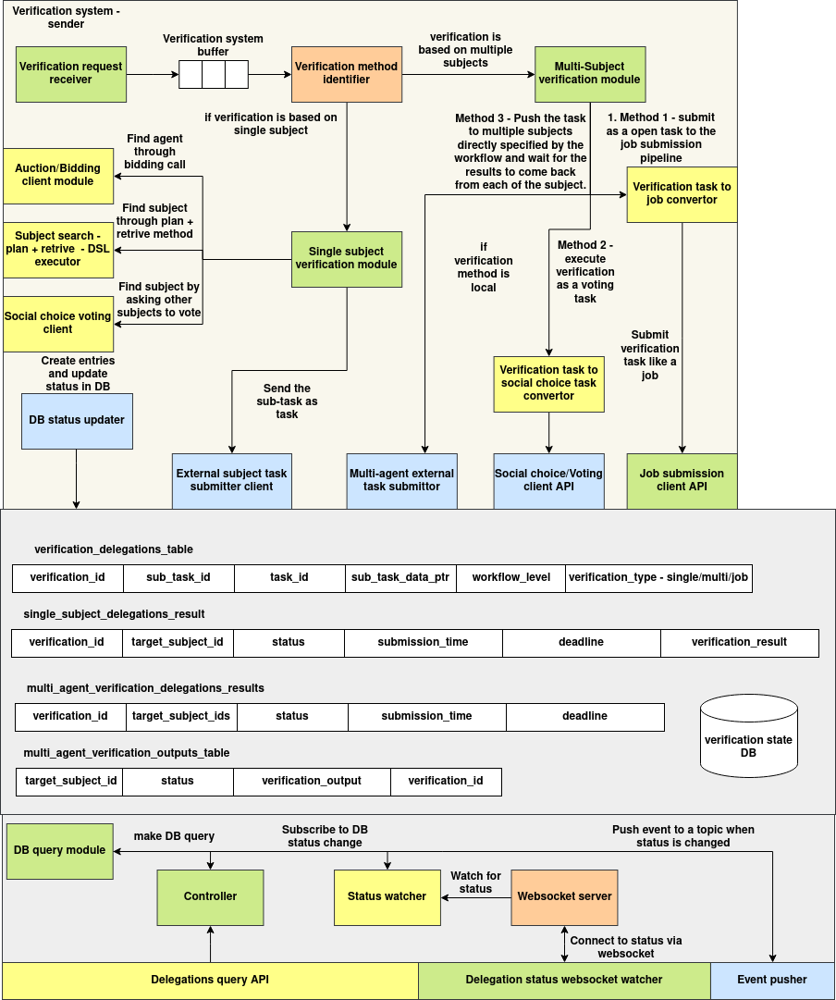

# Verification System

## Introduction

The **Verification System** manages task delegation and result verification workflows for subjects (agents). It supports creating and managing verification assignments, storing results in MongoDB, and broadcasting live updates via WebSocket.

This system includes:

* **Schema** definitions using Python dataclasses
* **database client** with full CRUD support
* **Flask REST API** for external interaction
* **WebSocket server** for real-time updates to connected clients

---

## Architecture



The **Verification System** follows a modular and event-driven architecture that enables asynchronous, multi-agent task delegation and verification with real-time status updates. It is composed of three core layers: **Verification Processing Pipeline**, **Delegation State Management**, and **Status Broadcast System**.

### 1. Verification Processing Pipeline

The pipeline begins with the **Verification Request Receiver**, which places new requests into a **Verification Buffer**. Each request is evaluated by the **Verification Method Identifier** to determine whether the task requires a single subject or multiple agents.

* For **single-subject verifications**, the system uses DSL-based planning or auction modules to locate a suitable agent. The selected agent is issued a task through the **Single Subject Verification Module**, which hands it off to the **External Subject Task Submitter Client**.

* For **multi-agent verifications**, the request flows into the **Multi-Subject Verification Module**, which offers three execution strategies:

  * **Job-based submission**, via the **Verification Task to Job Converter**
  * **Voting-based decision**, using the **Social Choice Task Converter** and the **Voting Client API**
  * **Workflow-specific delegation**, where the module pushes the task to all specified agents and awaits results

All task creation and status updates are handled centrally by the **DB Status Updater** component.

### 2. Delegation State Management

All verification metadata is persisted in the **Verification State Database**, which includes:

* `verification_delegations_table`: primary metadata for verification requests
* `single_subject_delegations_result` and `multi_agent_verification_delegations_results`: individual and collective outcomes
* `multi_agent_verification_outputs_table`: detailed verification outputs for each agent

These tables are indexed and accessed via the **DB Query Module**, allowing internal and external clients to inspect and monitor task states.

### 3. Status Broadcast System

To enable real-time tracking, the **Status Watcher** subscribes to DB-level status changes and emits events when state updates occur. These are transmitted over the **WebSocket Server**, allowing clients to subscribe to status channels for specific tasks or sub-tasks.

The **Controller** mediates database queries, while the **Event Pusher** publishes updates to appropriate listeners. This ensures synchronization between backend processing and front-end interfaces.

---

## Schema

### `DelegationResult`

```python
@dataclass
class DelegationResult:
    target_subject_id: str
    status: str
    submission_time: Optional[datetime] = None
    deadline: Optional[datetime] = None
    verification_result: dict = field(default_factory=dict)
    verification_output: dict = field(default_factory=dict)
```

| Field                 | Type       | Description                                   |
| --------------------- | ---------- | --------------------------------------------- |
| `target_subject_id`   | `str`      | ID of the delegated subject                   |
| `status`              | `str`      | Task status (e.g. `pending`, `completed`)     |
| `submission_time`     | `datetime` | When result was submitted                     |
| `deadline`            | `datetime` | Deadline for task completion                  |
| `verification_result` | `dict`     | Structured output from subject's verification |
| `verification_output` | `dict`     | Additional output data                        |

---

### `VerificationDelegation`

```python
@dataclass
class VerificationDelegation:
    task_id: str
    subject_id: str
    sub_task_id: Optional[str] = None
    sub_task_data_ptr: Optional[str] = None
    workflow_level: Optional[str] = None
    verification_type: Optional[str] = None
    single_subject_results: List[DelegationResult] = field(default_factory=list)
    multi_agent_results: List[DelegationResult] = field(default_factory=list)
    created_at: datetime = field(default_factory=datetime.utcnow)
    updated_at: Optional[datetime] = None
```

| Field                    | Type           | Description                                 |
| ------------------------ | -------------- | ------------------------------------------- |
| `task_id`                | `str`          | Unique task identifier                      |
| `subject_id`             | `str`          | Subject responsible for initiating the task |
| `sub_task_id`            | `str`          | Optional sub-task ID                        |
| `sub_task_data_ptr`      | `str`          | Pointer to data source                      |
| `workflow_level`         | `str`          | Workflow level of delegation                |
| `verification_type`      | `str`          | Type of verification (manual, auto, etc.)   |
| `single_subject_results` | `List[Result]` | Results from individual subjects            |
| `multi_agent_results`    | `List[Result]` | Results from multi-agent collaboration      |
| `created_at`             | `datetime`     | Timestamp of task creation                  |
| `updated_at`             | `datetime`     | Timestamp of last update                    |

---

## APIs

### `POST /verifications`

Create a new verification task.

**Request:**

```json
{
  "task_id": "task123",
  "subject_id": "user_abc",
  "verification_type": "manual",
  "single_subject_results": [
    {
      "target_subject_id": "agent_1",
      "status": "pending"
    }
  ]
}
```

**cURL:**

```bash
curl -X POST http://localhost:5000/verifications \
  -H "Content-Type: application/json" \
  -d '{
    "task_id": "task123",
    "subject_id": "user_abc",
    "verification_type": "manual",
    "single_subject_results": [
      {
        "target_subject_id": "agent_1",
        "status": "pending"
      }
    ]
  }'
```

---

### `GET /verifications/<verification_id>`

Retrieve a verification task by ID.

**cURL:**

```bash
curl http://localhost:5000/verifications/665f46fa2eced7ed85dff231
```

---

### `PUT /verifications/<verification_id>`

Update an existing verification.

**Request:**

```json
{
  "verification_type": "auto",
  "updated_at": "2025-06-04T11:00:00"
}
```

**cURL:**

```bash
curl -X PUT http://localhost:5000/verifications/665f46fa2eced7ed85dff231 \
  -H "Content-Type: application/json" \
  -d '{
    "verification_type": "auto",
    "updated_at": "2025-06-04T11:00:00"
  }'
```

---

### `DELETE /verifications/<verification_id>`

Delete a verification task by ID.

**cURL:**

```bash
curl -X DELETE http://localhost:5000/verifications/665f46fa2eced7ed85dff231
```

---

### `GET /verifications/task/<task_id>`

Query verifications by task ID.

**cURL:**

```bash
curl http://localhost:5000/verifications/task/task123
```

---

### `POST /verifications/<verification_id>/submit-result`

Submit a result for a delegated subject.

**Request:**

```json
{
  "target_subject_id": "agent_1",
  "status": "completed",
  "result_data": {
    "verification_result": {
      "pass": true
    },
    "verification_output": {
      "notes": "All checks passed."
    }
  }
}
```

**cURL:**

```bash
curl -X POST http://localhost:5000/verifications/665f46fa2eced7ed85dff231/submit-result \
  -H "Content-Type: application/json" \
  -d '{
    "target_subject_id": "agent_1",
    "status": "completed",
    "result_data": {
      "verification_result": {
        "pass": true
      },
      "verification_output": {
        "notes": "All checks passed."
      }
    }
  }'
```

---

## WebSocket Server + Python Client Example

### Server Endpoint

The WebSocket server listens on:

```
ws://localhost:8765/ws/<subject_id>/<task_id>[/<sub_task_id>]
```

Whenever a verification is created or updated, connected clients receive a JSON message with the latest verification document.

### Sample Python WebSocket Client

```python
import asyncio
import websockets

async def listen_updates():
    uri = "ws://localhost:8765/ws/user_abc/task123"
    async with websockets.connect(uri) as websocket:
        print("Listening for updates...")
        while True:
            message = await websocket.recv()
            print(f"Received update: {message}")

asyncio.run(listen_updates())
```

To receive updates for a specific sub-task:

```python
uri = "ws://localhost:8765/ws/user_abc/task123/subtask1"
```

---

## Verification Client

---

### Introduction

The `Verification Client` module provides high-level tools to interact with the **verification and voting system** using REST and NATS. It enables:

* Creating and submitting verification tasks
* Pushing and receiving real-time responses via NATS
* Managing social choice tasks and votes using REST APIs
* Performing asynchronous coordination using event-based protocols

This module abstracts underlying communication and simplifies integration into distributed agent systems.

---

### Importing Guide

To use the verification client, import it as:

```python
from agent_sdk.verification import *
```

This gives access to:

* `VerificationClient`: Wrapper around REST APIs and WebSocket listeners
* `TaskDBResponseWaiter`: Listens to WebSocket-based result updates
* `AdhocVerification`: Pushes verification events over NATS
* `AdhocVerificationReceiver`: Listens for ad-hoc verification messages via NATS
* `AdhocVerificationResponsePusher`: Sends verification responses over NATS
* `SocialTaskService`: Manages social tasks and voting flows

---

### Submitting Task for Verification

You can submit a new verification task using `VerificationClient`:

```python
from agent_sdk.verification import VerificationClient

client = VerificationClient("http://localhost:5000")

response = client.create_verification(
    task_id="task_123",
    subject_id="agent_a",
    sub_task_id="subtask_xyz",
    verification_type="manual"
)

print("Verification ID:", response)
```

You can also push an ad-hoc verification message directly over NATS:

```python
from agent_sdk.verification import AdhocVerification

verifier = AdhocVerification("nats://localhost:4222")
verifier.push(
    subject="agent_a__task_123",
    event_type="start_verification",
    sender_subject_id="agent_b",
    event_data={"input": "data"}
)
verifier.close()
```

---

### Waiting for Verification Result

#### Via WebSocket (TaskDBResponseWaiter)

Use this to stream updates from the backend via a WebSocket server:

```python
from agent_sdk.verification import VerificationClient

waiter = VerificationClient("http://localhost:5000").create_waiter("task_123", "subtask_xyz")

for update in waiter.get_results():
    print("Received update:", update)
    break
```

#### Via NATS (AdhocVerificationReceiver)

You can receive ad-hoc verification responses like this:

```python
from agent_sdk.verification import AdhocVerificationReceiver

receiver = AdhocVerificationReceiver("nats://localhost:4222")
response = receiver.receive(subject_id="agent_a", verification_id="task_123")
print("Received:", response)
receiver.close()
```

---

To push a response:

```python
from agent_sdk.verification import AdhocVerificationResponsePusher

responder = AdhocVerificationResponsePusher("nats://localhost:4222")
responder.push(
    subject_id="agent_a",
    verification_id="task_123",
    response_data={"verified": True}
)
responder.close()
```

---

### Social Choice and Voting Client

To manage social tasks and voting flows, use the `SocialTaskService`:

```python
from agent_sdk.verification import SocialTaskService

service = SocialTaskService("http://localhost:5001")

# Create a new social task
task = service.create_social_task(
    created_by_subject_id="agent_a",
    voting_type="majority",
    invited_subject_ids=["agent_b", "agent_c"],
    goal_data={"decision": "select_strategy"},
    status="pending",
    report={},
    voting_pqt_dsl_id="dsl_123",
    choice_evaluation_dsl="eval_dsl",
    deadline_time=1688888888
)

print("Created Social Task:", task.social_task_id)

# Wait for voting result (via NATS)
waiter = service.create_waiter_for_task(task_id=task.social_task_id)
result = waiter.get()
print("Voting Result:", result.voting_result)
```

---
